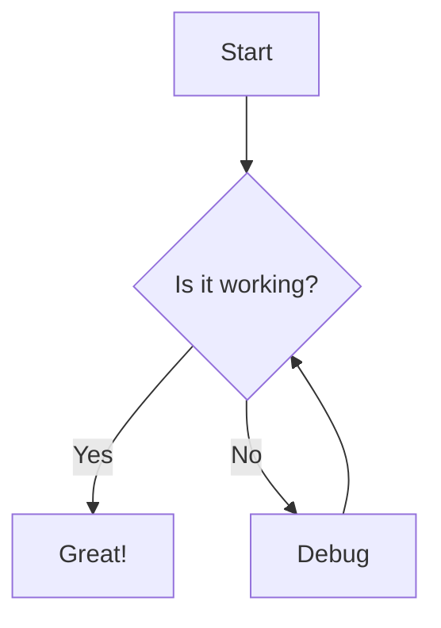

# NextGen .md Previewer Test File

This file tests all markdown formatting features.

## Basic Formatting

This is **bold text** and this is *italic text*.

This is ***bold and italic*** together.

This is ~~strikethrough~~ text.

This is `inline code` within a sentence.

## Headings

### Heading 3
#### Heading 4
##### Heading 5
###### Heading 6

## Links and Images

[This is a link to Google](https://google.com)

[Link with title](https://github.com "GitHub Homepage")


## Lists

### Unordered List
- Item 1
- Item 2
  - Nested item 2.1
  - Nested item 2.2
- Item 3

### Ordered List
1. First item
2. Second item
   1. Nested item 2.1
   2. Nested item 2.2
3. Third item

### Task List
- [x] Completed task
- [ ] Incomplete task
- [ ] Another task to do

## Blockquotes

> This is a blockquote.
> It can span multiple lines.
>
> > This is a nested blockquote.

## Code Blocks

```javascript
function hello(name) {
  console.log(`Hello, ${name}!`);
  return true;
}
```

```python
def hello(name):
    print(f"Hello, {name}!")
    return True
```

```json
{
  "name": "nextgen-md-previewer",
  "version": "0.1.0"
}
```

## Tables

| Feature | Status | Notes |
|---------|--------|-------|
| Bold | Working | Basic formatting |
| Italic | Working | Basic formatting |
| Tables | Testing | GFM extension |
| Math | Planned | KaTeX integration |

## Horizontal Rule

---

## Math Equations (Future)

Inline math: $E = mc^2$

Block math:
$$
\int_0^\infty e^{-x^2} dx = \frac{\sqrt{\pi}}{2}
$$

## Mermaid Diagrams (Future)



## Special Characters

- Ampersand: &
- Less than: <
- Greater than: >
- Quotes: "double" and 'single'

## Long Paragraph

Lorem ipsum dolor sit amet, consectetur adipiscing elit. Sed do eiusmod tempor incididunt ut labore et dolore magna aliqua. Ut enim ad minim veniam, quis nostrud exercitation ullamco laboris nisi ut aliquip ex ea commodo consequat. Duis aute irure dolor in reprehenderit in voluptate velit esse cillum dolore eu fugiat nulla pariatur.

---

*End of test file*
